# Voynich: Analysis & Visualization

* [https://beyondbeneath.github.io/voynich-viz/](https://beyondbeneath.github.io/voynich-viz/)

| Compare transition probabillities of tokens in A vs B | Compare token position preferences within pages of A vs B |
| :---| :--- |
|  |   |

A suite of Python analysis tools and web-based visualizations for exploring the Voynich manuscript transcription. This is not a solution or proposed solution, rather a tool to preprocess, extract and visualise data & relationships. All results are available to view per-language, per-hand, and per-illustration style section (among others). While there is a huge amount of amazing statistical work and visualisations published elsewhere on the web, this was largely designed to combat remarks to such analyses like "but what if you preprocessed tokens X and Y to form one token, since they always appear together", or "statistics for the whole manuscript are skewed by language A and B", or "I'd start by limiting your analysis to a more homogenous region like Q13, Q20".

This visualisation therefore allows us to visualise different features - for the whole manuscript, or a subset - and additionally look at "side by side" comparisons, and even a "diff" to highlight specific differences. The visualisation for the defauly preprocessing is available at:

* [https://beyondbeneath.github.io/voynich-viz/](https://beyondbeneath.github.io/voynich-viz/)

To introduce your own preprocessing, would require cloning the repo, changing some configuration, and re-running the outputs.

## Available visualisations

There are five main analyses presented:

1. Markov transition matrix
   * exaine the probability of transition from token A -> token B
   * includes probability transitions for word, line, paragraph and page boundaries
2. Word position preferenc
   * which tokens appear at the begining/middle/end of words
3. N-gram analysis
   * what are the common n-grams (1-grams, 2-grams, or 3-grams)?
4. Page position
   * do tokens preferentially appear at certain positions on a page?
   * provided at multiple granularities to reduce noise
   * provided at both page-scaled and manuscript scaled positions
5. Page position (physical)
   * similar to above, but uses actual pixel coordinates from word bounding boxes
   * character positions are interpolated within word bounds
   * provides a more accurate spatial representation than line/char indices

Examples:

| Type | Task | Screenshot |
| :---| :--- | :--- |
| Markov | Examine transition probabilities across the whole manuscript | 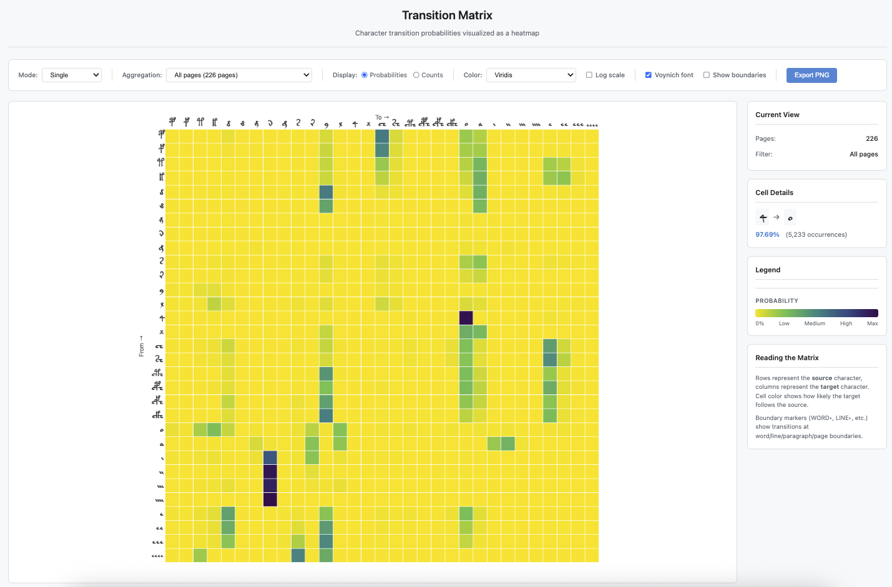 |
| Markov | As above, but include word/line/paragraph/page boundaries | 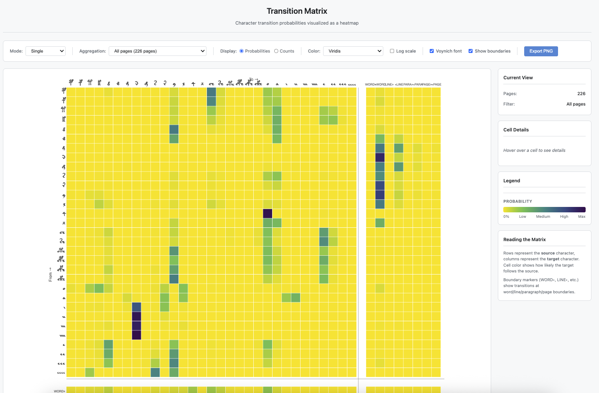 |
| Markov | Compare transition probabilities for Currier A vs B, side by side | 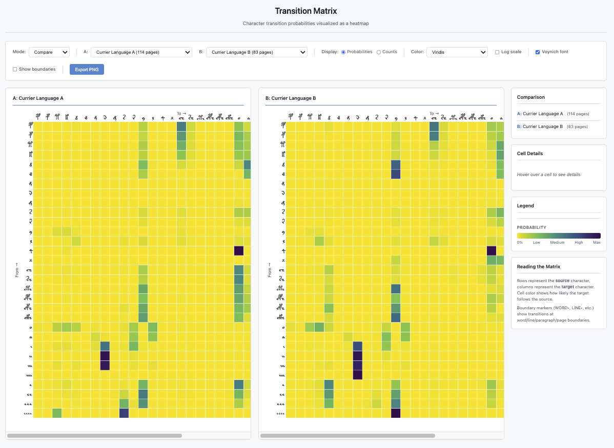 |
| Markov | Compare transition probabilities for Currier A vs B, as a diff | 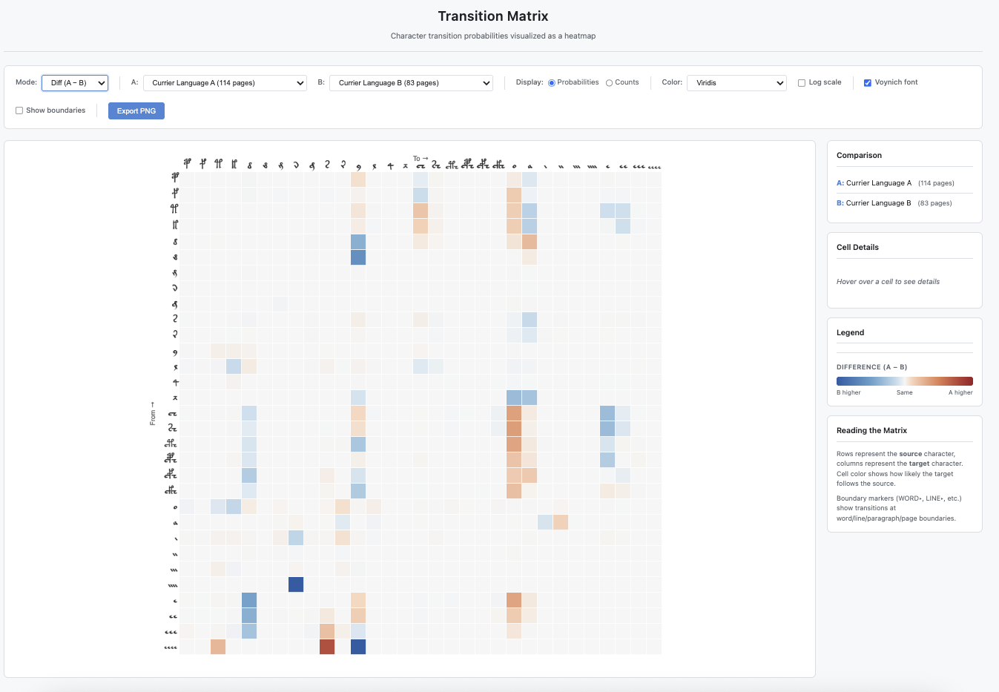 |
| Page position | Compare the position preferences of a specific token on a page for A vs B | 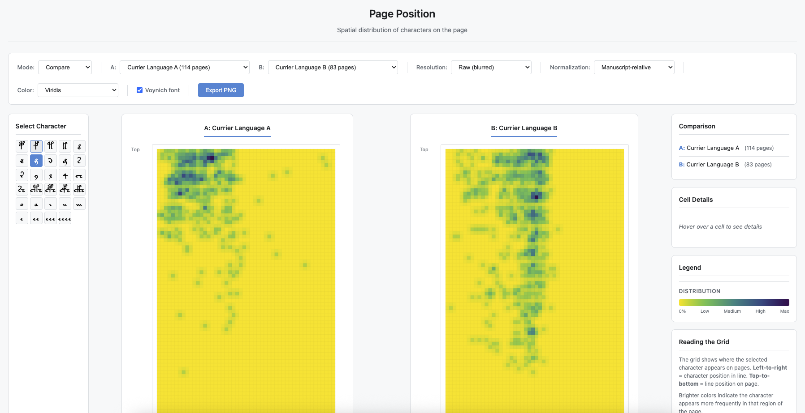 |
| Page position | Use a coarser grid to examine the page position preferences | 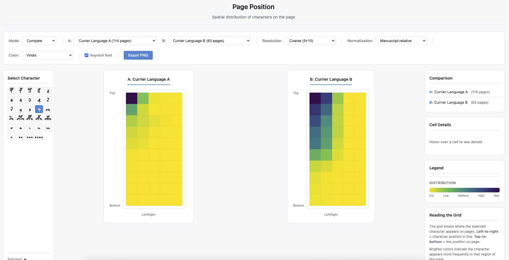 |
| N-gram | Look at the most common tokens (1-grams) for Currier A | 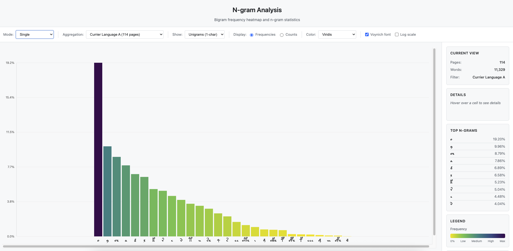 |
| N-gram | Compare most common tokens (1-grams) for Hand 1 vs Hand 2 | 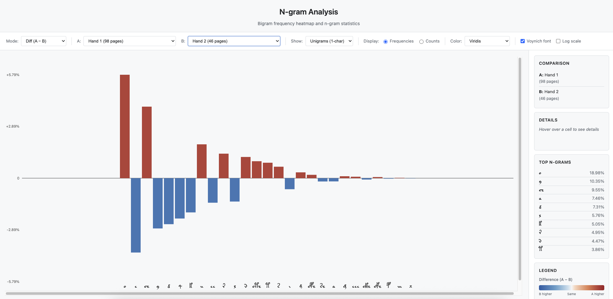 |
| N-gram | Look for divergence in bigram proportions for Hand 1 vs Hand 2 | 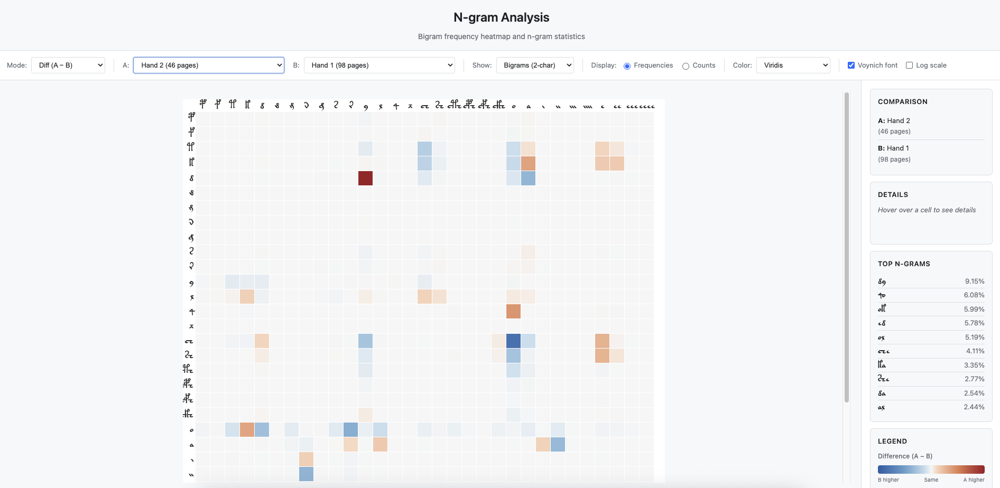 |
| Word position | See overall word order preference for tokens across whole manuscript | 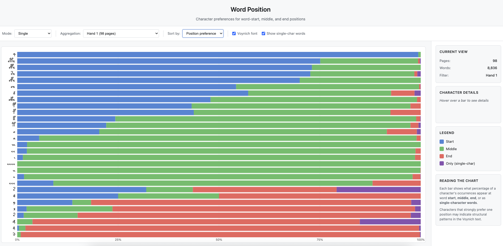 |

## Groupings

The following aggregations are available:

* Entire manuscript (no aggregation)
* By language
  * Currier A, Currier B
* By hand
  * 1,2,3,4,5
* By Illustration
  * herbal,zodiac,biological,pharmaceutical,astronomical,cosmological,text_only
* By Quire
  * Quire 13, Quire 20
* Combined Filters
  * Herbal section, Language A
  * Herbal section, Language B
  * Biological section, Language A
  * Biological section, Language B

The [methodology](https://beyondbeneath.github.io/voynich-viz/markov/methodology.html) page also allows exploration as to exactly which Quires/Folios/Pages are included in each aggregation, as well as the overlap of any given aggregation with another (e.g., for Currier A, what is the relative distribution of Hands 1/2/3/4/5 and Illustration types?). This acts as a mini-explorer in and of itself, really just visualising the metadata from the given transcription file:

| Inclusions | Overlap |
| :---| :--- |
| 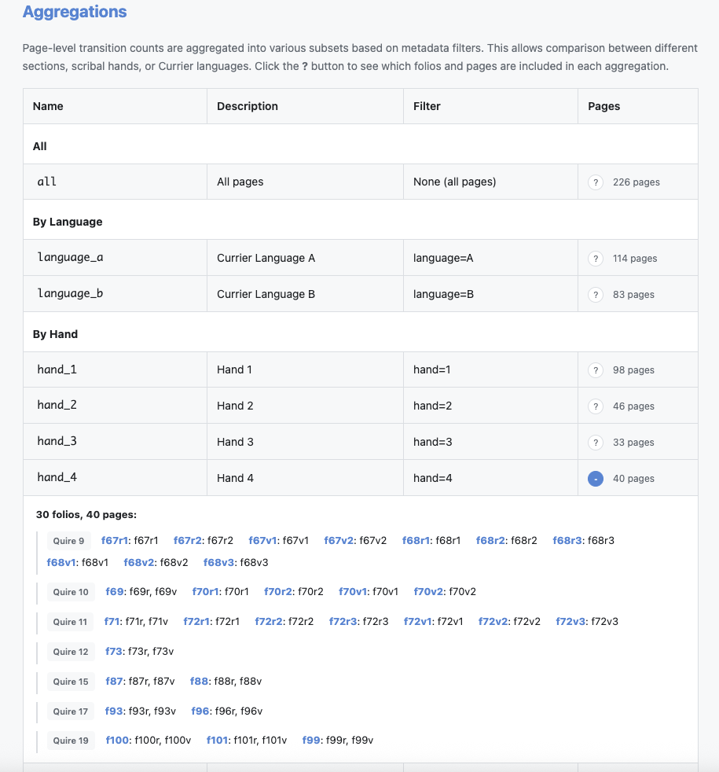 | 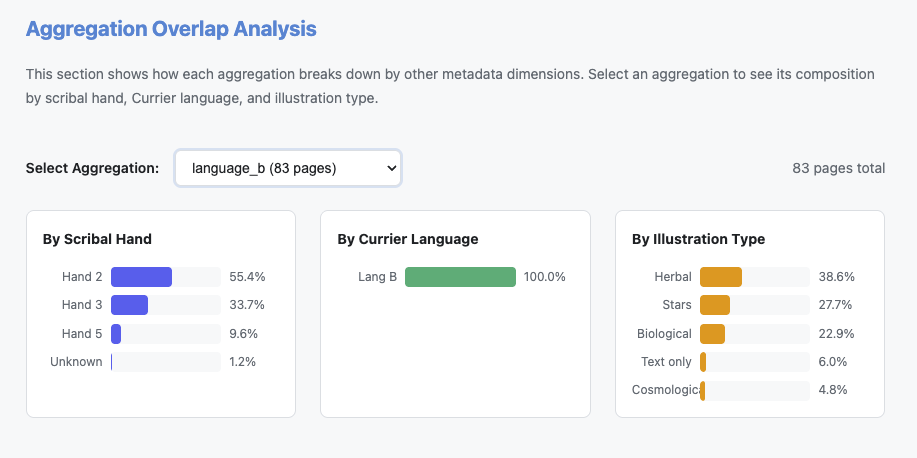  |

## Preprocessing details

The basic (default; included) configuration applies the following preprocessing:

Treat the following groups as single tokens (collapse them):

* cth
* cph
* cfh
* ckh
* ch
* sh
* i, ii, iii, iiii
* e, ee, eee, eeee

Further, we only process paragraph text (marked as 'P').

To modify these rules, and view the results, requires cloning the repo and modifying the code. In future releases I may try and ship this with multuple preconfigured prepocessings available, as desired by the community.

## Credits and acknowlegements

* General work inspired by writings by [Nick Pelling](https://ciphermysteries.com/), [Rene Zandbergen](https://voynich.nu/), [Patrick Feaster](https://griffonagedotcom.wordpress.com/2020/08/24/ruminations-on-the-voynich-manuscript/), [Sean Palmer](http://inamidst.com/voynich/stacks), [Emma May Smith](https://agnosticvoynich.wordpress.com/), Marco Ponzi, and others
* Relies on the Zandbergen-Landini transcription (described [here](https://voynich.nu/transcr.html) and [here](https://voynich.nu/extra/sp_transcr.html)), [v3.b](https://voynich.nu/data/ZL3b-n.txt) - referenced internally as `data/voynich-transcription.txt`
* Physical page position relies on the data powering [Voynichese.com](voynichese.com), namely the [XML files](https://www.voynichese.com/1/data/folio/voynichese_data.zip) ([source](https://github.com/voynichese/voynichese/blob/wiki/About.md) on Github).
* Code written with Claude (mostly `opus-4.5-thinking`) via Cursor AI

# More details (auto-generated)

## What this project does

This repository provides multiple analysis pipelines over the Voynich transcription:

1. **Parse** IVTFF transcription and extract page metadata (Currier language, hand, section/illustration type)
2. **Normalize** glyph sequences (including bigram collapsing and i/e handling modes)
3. **Analyze** via multiple methods:
   - **Markov**: Character transition probabilities with boundary markers
   - **N-gram**: Unigram, bigram, and trigram frequency analysis
   - **Word Position**: Character preferences for word start/middle/end positions
   - **Page Position**: Spatial distribution of characters on the page (left/right, top/bottom)
   - **Physical Page Position**: Spatial distribution using actual pixel coordinates from word bounding boxes
4. **Aggregate** results by filters (language, hand, section, and combinations)
5. **Visualize** in the browser with compare and diff modes

## Repository structure

```text
voynich/
├── data/
│   ├── voynich-transcription.txt
│   ├── voynichese.zip             # Physical word positions (XML per folio)
│   └── transcription-format.html
├── scripts/
│   ├── common/                    # Shared parser, normalizer, config
│   ├── markov/                    # Markov transition pipeline
│   ├── ngram/                     # N-gram analysis pipeline
│   ├── wordpos/                   # Word position pipeline
│   ├── pagepos/                   # Page position pipeline
│   ├── physpagepos/               # Physical page position pipeline
│   └── requirements.txt
└── docs/                          # GitHub Pages root
    ├── index.html                 # Analysis landing page
    ├── output/                    # Generated data (scripts write here)
    │   ├── transcription_config.json
    │   ├── markov/
    │   ├── ngram/
    │   ├── wordpos/
    │   ├── pagepos/
    │   └── physpagepos/
    ├── markov/                    # Transition matrix visualization
    ├── ngram/                     # N-gram frequency visualization
    ├── wordpos/                   # Word position visualization
    ├── pagepos/                   # Page position visualization
    └── physpagepos/               # Physical page position visualization
```

## Install

Clone the repository:

```bash
git clone https://github.com/beyondbeneath/voynich-viz/
```

## Reproduce data extraction

Run from the repository root:

```bash
# Markov: Full pipeline with default settings
python -m scripts.markov.main --input data/voynich-transcription.txt --output docs/output/markov/ -v

# N-gram extraction (unigram/bigram/trigram frequencies)
python -m scripts.ngram.main --input data/voynich-transcription.txt --output docs/output/ngram/ -v

# Word-position extraction (start/middle/end preferences)
python -m scripts.wordpos.main --input data/voynich-transcription.txt --output docs/output/wordpos/ -v

# Page-position extraction (spatial distribution on page)
python -m scripts.pagepos.main --input data/voynich-transcription.txt --output docs/output/pagepos/ -v

# Physical page-position extraction (using actual pixel coordinates from word bounding boxes)
python -m scripts.physpagepos.main --xml-source data/voynichese.zip --transcription data/voynich-transcription.txt --output docs/output/physpagepos/ -v
```

The page position analysis supports two normalization modes:
- **Page-relative**: Positions normalized within each page (a 2-line page has lines at 0% and 100%)
- **Manuscript-relative**: Positions normalized to global max (81 lines, 97 chars/line observed)

The physical page position analysis uses word bounding boxes from the Voynichese XML files, interpolating character positions within each word. This provides more accurate spatial positioning than line/character indices.

### Variants
```
# Markov: 2) Collapsed i/e mode
python -m scripts.markov.main --input data/voynich-transcription.txt --output docs/output/markov/ --bigram-mode collapsed -v

# Markov: 3) Disable boundary tokens
python -m scripts.markov.main --input data/voynich-transcription.txt --output docs/output/markov/ --no-word-boundaries --no-line-boundaries -v
```

## Run the web viewer

```bash
cd docs
python -m http.server 8000
```

Then open `http://localhost:8000`.

## Output files

Each analysis script generates:

- `docs/output/<method>/page_*.json` — Per-page analysis results
- `docs/output/<method>/aggregated/*.json` — Aggregated results by filters
- `docs/output/<method>/aggregated/manifest.json` — Available aggregations
- `docs/output/<method>/metadata.json` — Processing configuration

Additionally, all scripts output a shared config file:

- `docs/output/transcription_config.json` — Character ordering, display mappings, boundary tokens, and aggregation definitions used by all web visualizations

## Configuration architecture

The project uses a **single source of truth** pattern for transcription config:

1. **Python** (`scripts/common/config.py`) defines all shared configuration:
   - Character display mappings (e.g., `C` → `ch`, `1` → `i`)
   - Canonical character ordering for visualizations
   - Boundary token definitions
   - Aggregation filter definitions

2. **On each run**, scripts output `docs/output/transcription_config.json`

3. **Web visualizations** load this JSON at startup, so changes to the Python config automatically propagate to all viewers after re-running the scripts

This means you can modify character ordering, add new aggregations, or change display mappings in one place (`scripts/common/config.py`), re-run the analysis, and all visualizations update automatically.

## Add a new analysis type

To add another analysis module:

1. Create `scripts/<name>/` with a CLI entry point (`main.py`) and analysis modules
2. Import shared config from `common.config` (character sets, aggregations, etc.)
3. Call `save_transcription_config()` after processing to update the shared config
4. Write results to `docs/output/<name>/`
5. Build a viewer in `docs/<name>/` that loads `transcription_config.json` on init
6. Add a card/link in `docs/index.html`
